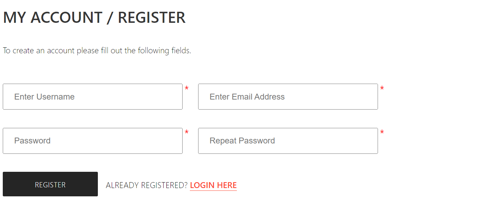
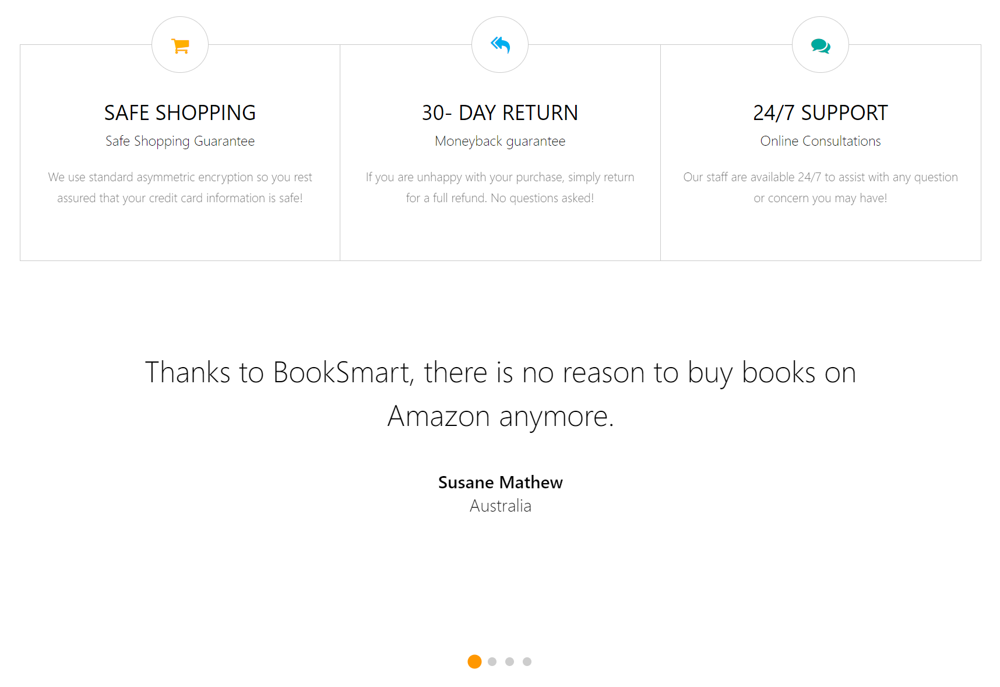

# BookSmart
This is a full stack web application on an E-commerce bookstore.

Frontend uses Thymeleaf and HTML/CSS/JavaScript tech.

Backend bootstraps with Spring framework, H2 for in-memory database, JPA/Hibernate for ORM, and Spring security for authentication and authorization.

## Screenshots

### Development
To run: `./mvnw spring-boot:run`

View on `http://localhost:8080/`

    To access the H2 database, go to http://localhost:8080/h2-console/

### Data Information
Mock data are seeded in the Seeder.java class

Data source can be configured in application.properties